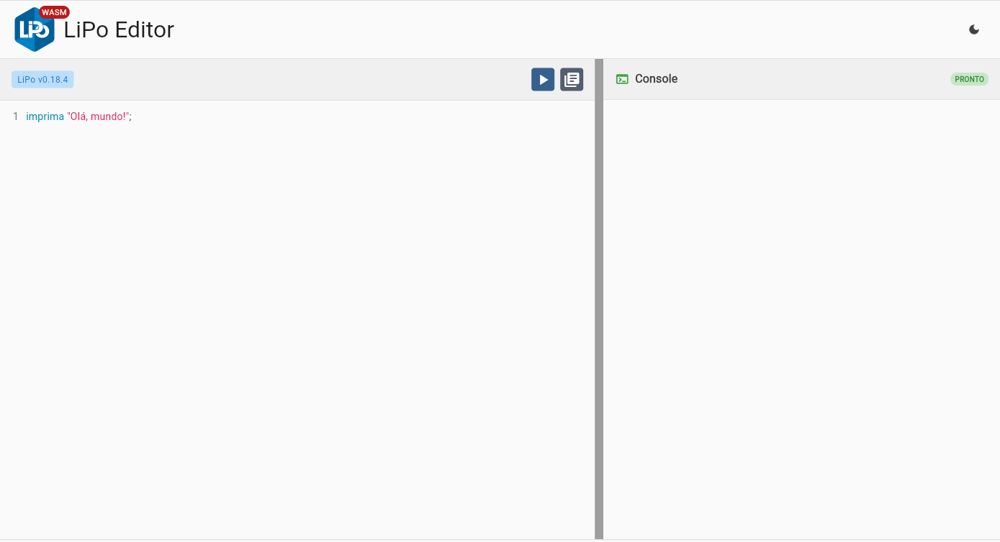
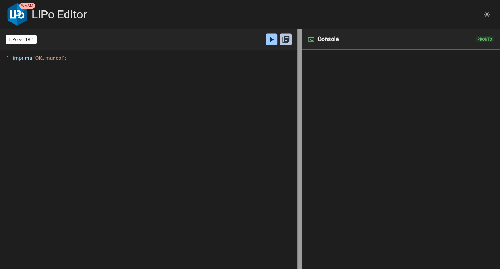
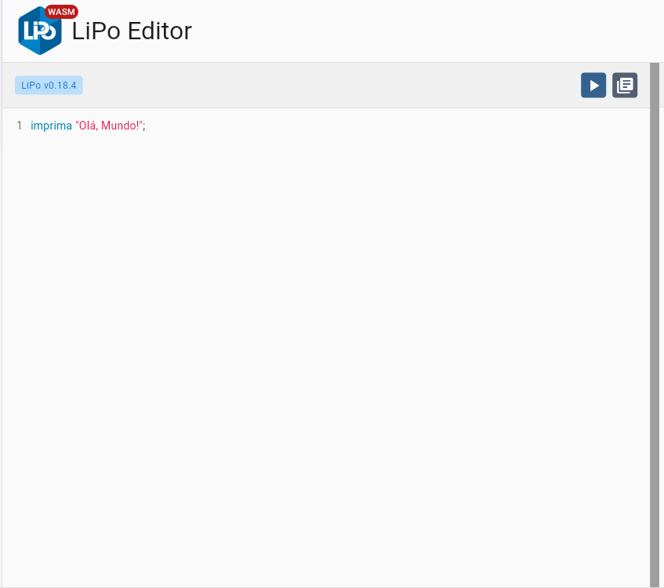
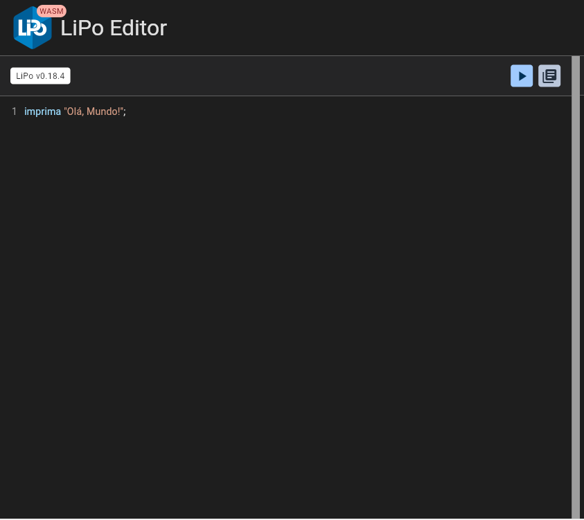

## Introdução

O LiPo Editor é um ambiente de desenvolvimento online que permite escrever, executar e testar códigos na linguagem LiPo sem precisar instalar nada em seu computador. Ele utiliza tecnologia WASM para rodar o compilador LiPo diretamente no navegador.

- **Execução instantânea:** Escreva seu código na área à esquerda e execute em tempo real.
- **Console:** Veja a saída do seu código na área à direita.
- **Compilador WebAssembly:** Roda o código LiPo de forma rápida e segura.
- **Suporte a exemplos:** Teste comandos básicos, como o clássico `imprima "Olá, Mundo!";`.
- **Interface intuitiva:** Botão de executar, reiniciar e opções de visualização.
- **Versão exibida:** Sempre mostra a versão atual do compilador LiPo (ex: v0.18.4).
 
## Fluxo de trabalho do editor da Web

Veja como você normalmente trabalhará no editor web:

<Steps>
  <Step title="Acessar">
    * Tu abre editor.lipolang.dev no navegador.
    * Não precisa instalar nada — é zero configuração.
  </Step>

  <Step title="Escrever o código">
    * No painel principal, cola ou digita teu código em LiPo (Portugol).
  </Step>

  <Step title="Rodar">
    * Tem um botão icon  Executar / Run ( topo).
    * Clicou → o código passa pelo compilador LiPo que roda por trás do editor.
  </Step>

  <Step title="Ver a saída">
    * O resultado aparece na janela de output (geralmente embaixo).
    * Se deu erro, a saída mostra a mensagem indicando o problema (linha, tipo de erro etc).
  </Step>

  <Step title="Aperto botão exemplos">
      * Podendo ter exemplos prontos para algumas situações.
  </Step>
</Steps>

## Design do lipo web

<Frame>
  {/* Imagem para modo claro */}
  

  {/* Imagem para modo escuro */}
  
</Frame>

- **Interface limpa e funcional**  
  O LiPo Editor apresenta um design minimalista, organizado e de fácil utilização.  

- **Divisão em duas áreas principais**  
  A interface é estruturada em seções distintas:  
  - Área de edição de código.  
  - Área de console para exibição da saída.  

- **Layout simples e objetivo**  
  O foco está na experiência do usuário, eliminando elementos desnecessários.  

- **Uso de cores suaves**  
  A paleta de cores foi escolhida para proporcionar conforto visual durante o uso.  

- **Contraste adequado**  
  O editor garante boa legibilidade, permitindo leitura prolongada sem esforço.  

- **Modo escuro (Dark Mode)**  
  O editor oferece a opção de alternar para o dark mode, proporcionando maior conforto visual em ambientes com pouca luz.  

- **Experiência focada no usuário**  
  Todo o ambiente foi pensado para que o usuário concentre-se tanto na escrita quanto na execução do código, sem distrações.  


## Editor código do lipo web

<Frame>
  {/* Imagem para modo claro */}
  

  {/* Imagem para modo escuro */}
  
</Frame> 

- **LiPo Editor**  
  Ambiente online voltado para escrever e executar códigos na linguagem **LiPo**.  

- **Logotipo e indicador WASM**  
  Localizado no canto superior esquerdo, exibe o logotipo do LiPo com a marcação **WASM**, indicando que a execução é feita diretamente no navegador via WebAssembly.  

- **Versão do editor**  
  Logo abaixo do logotipo aparece um botão com a versão utilizada (**LiPo v0.18.4**), permitindo identificar em qual release o editor está rodando.  

- **Área central de edição**  
  Espaço principal para escrever o código, com destaque de sintaxe em cores diferentes, facilitando a leitura e a identificação de comandos, strings e estruturas da linguagem.  

- **Exemplo exibido**  
  O editor mostra a instrução:  
  ```lipo
  imprima "Olá, Mundo!";


## Console código do lipo web


<Frame>
  {/* Imagem para modo claro */}
  

  {/* Imagem para modo escuro */}
  
</Frame> 

 - **Console**  
  Área localizada logo abaixo do editor, responsável por exibir o resultado da execução do código.  

- **Título e ícone**  
  No canto superior esquerdo, aparece o título **Console** acompanhado de um ícone verde de saída, indicando que esse espaço é dedicado a mostrar mensagens retornadas pelo programa.  

- **Status de execução**  
  No canto superior direito, é exibido o status **PRONTO**, em verde, sinalizando que a execução foi concluída com sucesso, sem erros de compilação ou execução.  

- **Saída do programa**  
  No espaço central do console é exibido o resultado da execução.  
  Exemplo mostrado: 
  ```Olá, Mundo! ```

 <Note> Esse texto confirma que a instrução `imprima` funcionou corretamente e exibiu a mensagem na saída padrão.  </Note>

- **Função principal**  
O console atua como a interface de interação com o usuário, apresentando resultados, mensagens de execução e eventuais erros do programa.  

## Próximos passos

* Exemplos Prontos [Exemplos Praticos](/pages/exemplos_praticos/exemplo_1_programa_basico).
* Conheça site Lipo web [Lipo_editor](https://editor.lipolang.dev).
